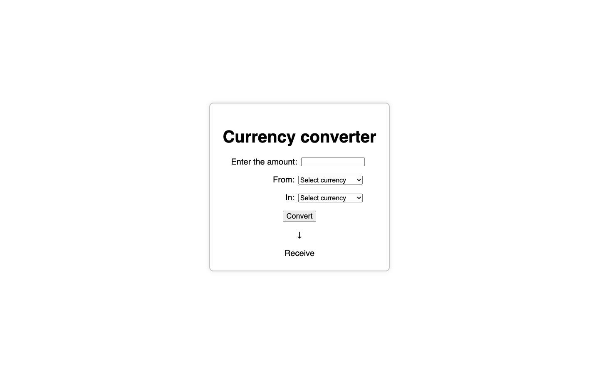

# Currency converter

Project link:

## Description

Simple web application for currency conversion with current retes

## Peculiarities

- 🔁 **Realtime conversion** using current exchange rates
- 📱 **Adaptive interface**
- 💾 **Local data** processing without page reloading
- 🌏 **Support for 10+ currencies** (USD, EUR, RUB and others)
- 🏎️ **Instant results** accurate to 2 decimal places 

## ⚙️ Installation and configuration

### Local load:

`git clone https://github.com/yourusername/currency-converter.git`

`cd currency-converter`

Open file `index.html` file in your browser or use Live Server in your code editor

### How to use

1. Select the source currency
2. Select the target currency
3. Enter the amount
4. Click "Convert"
5. The result will appear in the window below the arrow

## 📸 Screnshoots

## 🛠️ Technologies

- Structure: HTML
- Style: CSS3
- Logistics: Vanilla JavaScript

## 🧑🏻‍💻 API 

This project uses FreeCurrencyAPI ([https://app.freecurrencyapi.com/](https://app.freecurrencyapi.com/)) for up-to-date exchange rates. Check out the FreeCurrencyAPI documentation for rate limits and available currencies.

# Contacts

- Email: fnaffi095@gmail.com
- GitHub: selikon13 (https://github.com/selikon13)